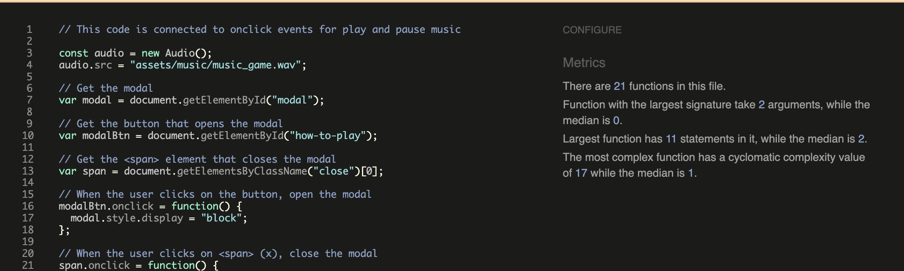
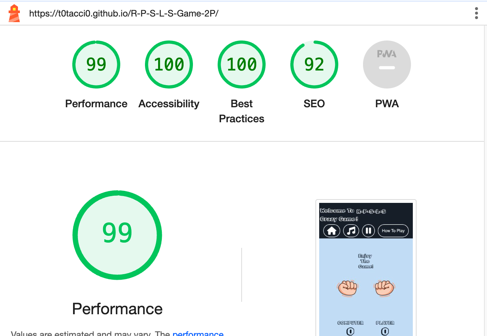
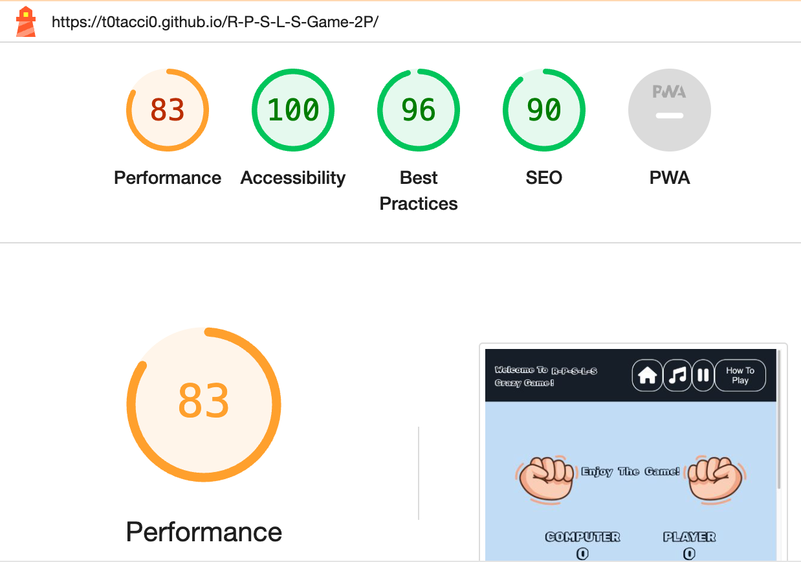

# Rock,Paper,Scissors,Lizard and Spock Game

Rock-paper-scissors-lizard-Spock is a five-gesture expansion of the classic selection method
game rock-paper-scissors. It operates on the same basic principle, but includes two additional
weapons: the lizard (formed by the hand as a sock-puppet-like mouth) and Spock (formed by the
Star Trek Vulcan salute). This reduces the chances of a round ending in a tie. The game was
invented by Sam Kass with Karen Bryla, as "Rock Paper Scissors Spock Lizard".

[Rock,Paper,Scissors,Lizard and Spock Game live site](https://t0tacci0.github.io/R-P-S-L-S-Game-2P/)

---

## Table of Contents

### [User Experience (UX)](#user-experience-ux-1)

- [User Stories](#user-stories)

### [Features](#features)

- [Existing Features](#existing-features)

### [Features Left to Implement](#features-left-to-implement-1)

### [Design](#design-1)

### [Technologies Used](#technologies-used-1)

### [Frameworks, Libraries & Programs Used](#frameworks-libraries--programs-used-1)

### [Testing](#testing-1)

- [Validation Results](#validation-results)
- [Manual Testing](#manual-testing)
- [Lighthouse Report](#lighthouse-report)

### [Unfixed Bugs](#unfixed-bugs-1)

### [Deployment and local development](#deployment-and-local-development-1)

[GitHub Pages](#github-pages)
- [Forking the GitHub Repository](#forking-the-github-repository)
- [Local Clone](#local-clone)

### [Credits](#credits-1)

### [Acknowledgements](#acknowledgements-1)

## User Experience (UX)

The site is aimed at people who want to play a user-friendly and easy Rock,Paper and scissors revisited game.
There is a header with all main buttons: homepage,music and instructions for playing.

### User Stories

- First-time visitor goals
  - Trying the revisited 'Rock Paper Scissors' game created with basic JavaScript knowledge.
  - Seeing an example of a JavaScript game.
  - Easily navigate throughout the header choosing various buttons.
  - Find the Play button and start to play.
- Returning visitor goals
  - The design of the game is appealing let users to play more.
  - Trying to beat computer logic.

- Frequent user goals
  - Check if there are any update of the game or more features added.

---

### Features

- This website is targeting people who want to play user-friendly game.
- Revisited Rock,Paper and scissors game.
- Responsive on all device sizes.

### Existing Features

- Header section
  - Includes title animation name, home page, play button music, pause button music, rules instructions.
  - It is identical in design across desktop and mobile version.

- Main section
  - Includes all the entire game with a start button to start the game and a reset button to reset at anytime.
  - The chooses hands buttons will show after starting the game and the main play button will hide automatically.
  - The design is easy-friendly to make people not to be confused.
  - It is identical in design across desktop and mobile version as well.
 

- Footer section
  - In the footer section there is the name of the creator of the project with the correspondig year of creation.
 

---

## Features Left to Implement

* Insert a timer.
* Insert a difficulty option.
* Improve animation of the hands.
* Better design to make it more appealing and playful.

## Design

 * Colour Scheme
  - Primary colors used on the website: 

 * Typography
    * Rubik doodle shadow font is main font used throughout the site with sans-serif as its fallback font in case Kanit doesn't import for some reason.

 * Wireframes
  - Balsamiq wireframe used for both desktop and mobile screen: 

---

## Technologies Used

- [HTML5](https://en.wikipedia.org/wiki/HTML5)
- [CSS3](https://en.wikipedia.org/wiki/CSS)
- [JAVASCRIPT](https://en.wikipedia.org/wiki/JavaScript)

---

## Frameworks, Libraries & Programs Used

- [Codeanywhere](https://codeanywhere.com/platform)
  - Program used for coding
- [Github](https://github.com/)
  - Deployment of the website and storing the files online.
- [Google Fonts](https://fonts.google.com/)
  - Import main font the website.
- [Am I Responsive](https://ui.dev/amiresponsive)
  - Mockup picture for the README file.

---

## Testing

The W3C Markup Validator , W3C CSS Validator and JSHint validator services were used to validate every page of the project to ensure there were no errors.

- [W3C Markup Validtor](https://validator.w3.org/)
- [W3C CSS Validator](https://jigsaw.w3.org/css-validator/)
- [JSHint Validator](https://jshint.com/)

### Validation results

index.html

style.css

script.js

### Manual Testing

- The website was tested on Google Chrome, Microsoft Edge, and Safari.
- The website was viewed on a desktop computer, laptop, Samsung Galaxy Fold, iPad mini, iPhone 12 pro.
- Dev Tools was used to test how the site looks on various screen sizes.

### Lighthouse Report

#### Mobile analysis

Mobile screen

#### Desktop analysis

Desktop screen

---

### [Unfixed Bugs](#unfixed-bugs-1)

Since until now no bugs were found i can't say that some is being fixed.
Checking if any bugs can modify the project is under progress.

### [Deployment and local development](#deployment-and-local-development-1)

### [GitHub Pages](#github-pages)

GitHub Pages used to deploy live version of the website.

1. Log in to GitHub and locate [GitHub Repository R-P-S-L-S-Game-2P](https://github.com/t0tacci0/R-P-S-L-S-Game-2P)
2. At the top of the Repository(not the main navigation) locate "Settings" button on the menu.
3. Scroll down the Settings page until you locate "GitHub Pages".
4. Under "Source", click the dropdown menu "None" and select "Main" and click "Save".
5. The page will automatically refresh.
6. Scroll back to locate the now-published site [link](https://t0tacci0.github.io/R-P-S-L-S-Game-2P/) in the "GitHub Pages" section.

### [Forking the GitHub Repository](#forking-the-github-repository)

By forking the repository, we make a copy of the original repository on our GitHub account to view and change without affecting the original repository by using these steps:

1. Log in to GitHub and locate [GitHub Repository R-P-S-L-S-Game-2P](https://github.com/t0tacci0/R-P-S-L-S-Game-2P)
2. At the top of the Repository(under the main navigation) locate "Fork" button.
3. Now you should have a copy of the original repository in your GitHub account.

### [Local Clone](#local-clone)

1. Log in to GitHub and locate [GitHub Repository R-P-S-L-S-Game-2P](https://github.com/t0tacci0/R-P-S-L-S-Game-2P)
2. Under the repository name click "Clone or download"
3. Click on the code button, select clone with HTTPS, SSH or GitHub CLI and copy the link shown.
4. Open Git Bash
5. Change the current working directory to the location where you want the cloned directory to be made.
6. Type `git clone` and then paste The URL copied in the step 3.
7. Press Enter and your local clone will be created.

---

### [Credits](#credits-1)

### Code

- Understanding the concept of Image Shaking using CSS [w3schools - CSS Shake an Image](https://www.w3schools.com/howto/howto_css_shake_image.asp)
- Understanding the concept of Image 3D Transform using CSS [w3schools - CSS 3D Transform](https://www.w3schools.com/css/css3_3dtransforms.asp)
- Understanding the concept of Animation Text using HTML and CSS [w3schools - CSS Animation](https://www.w3schools.com/css/css3_animations.asp)
- The README template was helpfully provided by [Code Institute (template)](https://github.com/Code-Institute-Solutions/SampleREADME)

### Content

- All content was written by the developer.
- All hands images were downloaded from google search images.
- [Color contrast checker](https://coolors.co/contrast-checker/112a46-acc8e5) Used to check colour for background and elements of the project.

### Media

- [Favicon generator](https://favicon.io/favicon-converter/) Generate favicon from images.
- [Google Fonts](https://fonts.google.com/) Downloads text fonts.
- [Remove.bg](https://www.remove.bg/) Remove background images.
- [Freesound](https://freesound.org/) Downloads free sounds.
- [Fontawesome](https://fontawesome.com/) Create fonts.
- [Am I Responsive](https://ui.dev/amiresponsive) Check website responsive.

---

### [Acknowledgements](#acknowledgements-1)

- My mentor Mitko Bachvarov provided again great helpful feedback and important suggestions during all steps for my project.
- Slack community for encouragement and information.

---
